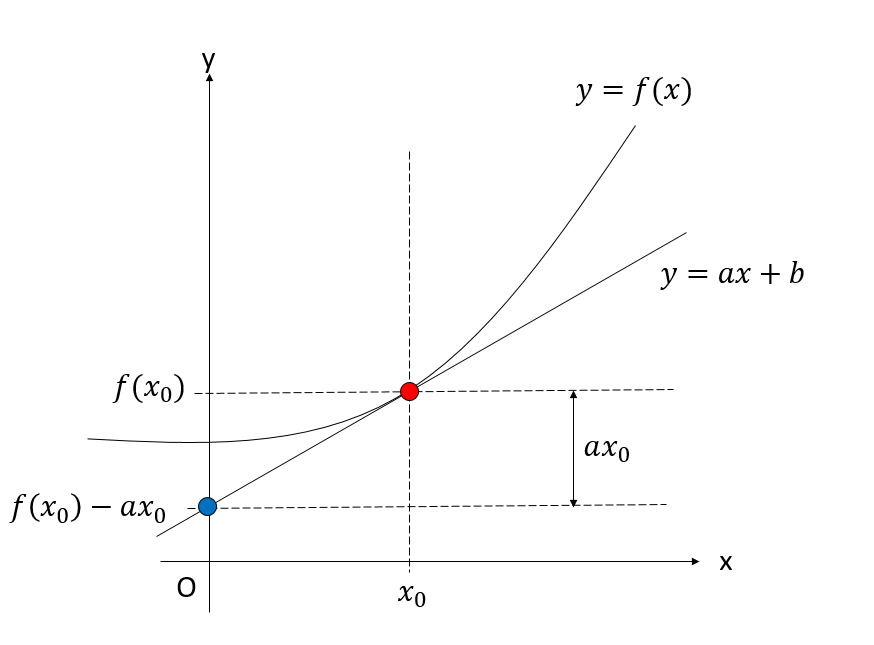
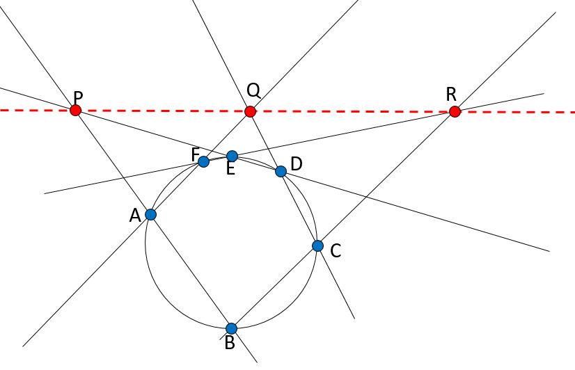
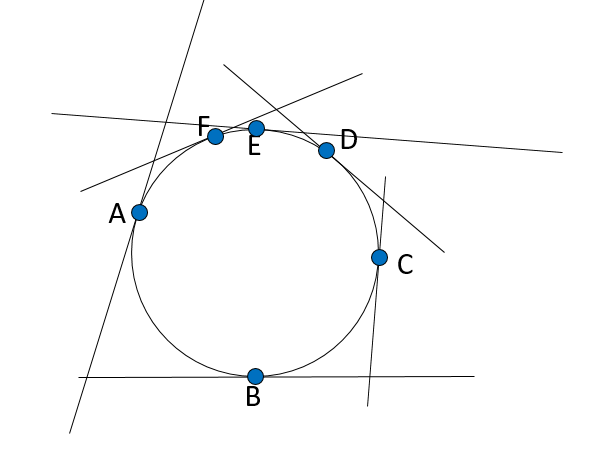
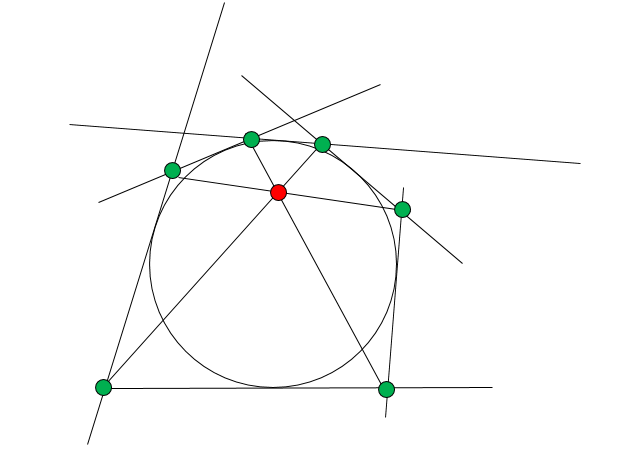
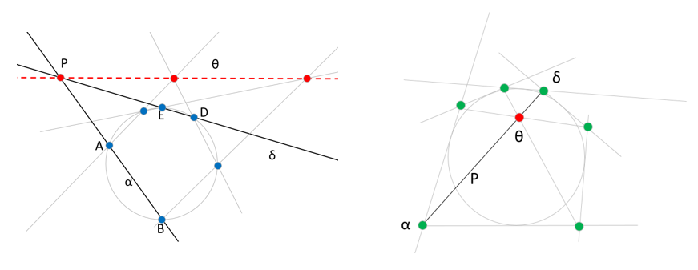

## はじめに

理工系の学生なら、熱力学や解析力学の講義でルジャンドル変換を学んだと思います。ルジャンドル変換は独立変数を取りかえるための変換ですが、これが何をやっているか、どういう意味を持っているかがよくわからに人も多いと思います。幾何学的に見ると、ルジャンドル変換は「点」と「線」を入れ替える双対変換になっています。この双対という考え方はいろんなところに現れます。以下、点と線、点と面の双対変換についてつらつら書いてみたいと思います。

## ルジャンドル変換

関数$y = f(x)$を考えます。これは一価関数であり、上か下に凸で、微分可能な関数であるとしましょう。この関数が表現するものは、$x-y$平面における曲線です。曲線とは点の集合です。二次元空間上の点は、二つのスカラー量の組$(x,y)$で表現することができます。つまり、曲線は、点$(x,y)$の集合、$\{(x,y)\}$として表現できます。

さて、この曲線の、ある点$x_0$における接線$y = a x + b$を考えましょう。ただし、$a = f'(x_0)$、$b = f(x_0) - x f'(x_0)$です。二次元空間上の直線も、傾き$a$と$y$切片$b$という二つのスカラー量で表現することができます。そこで、ある曲線$y=f(x)$上の、ある点$(x,y)$を、その点における接線の係数$(a,b)$で表現することを考えます。

$x_0$を動かしていくと、係数$(a,b)$も変化していきます。曲線が上か下に凸な関数であれば、この曲線の接線を表す集合$\{a,b\}$から、元の曲線を表す点の集合$\{x,y\}$を完全に再現することができます。つまり、ある関数を、「点の集合」ととらえることもできますし、「接線の集合」ととらえることもできます。これがルジャンドル変換です。つまり、ルジャンドル変換とは **「点」から「線」への双対変換** になっています。どちらも二次元ベクトルの集合として表現されているので、情報が落ちない可逆変換になっているのがわかると思います。

ここでは、$(x,y)$を、そこでの接線$y=ax+b$の係数$(a,b)$で表現しましたが、一般には逆変換で負符号がつかないように、$(a, -b)$を採用します。これにより、

$$
\begin{aligned}
x &\rightarrow f'(x) \\
f(x) &\rightarrow x f'(x) - f(x)
\end{aligned}
$$

という変換が導かれます。

多変数関数の場合も、他の変数を固定し、注目する変数での微分、つまり偏微分になるだけで全く同じです。例えば$(q,\dot{q})$の関数ラグランジアン$L(q,\dot{q})$を、$\dot{q}$についてルジャンドル変換すると、先の公式で$x$を$\dot{q}$,$f(x)$を$L$にするだけなので、

$$
\begin{aligned}
\dot{q} &\rightarrow \frac{\partial L}{\partial \dot{q}} \\
L(q,\dot{q}) &\rightarrow \dot{q} \frac{\partial L}{\partial \dot{q}} - L
\end{aligned}
$$

が得られます。ここで$(\dot{q}, L)$をルジャンドル変換して得られた変数の組を$(p,H)$と呼ぶと、

$$
\begin{aligned}
p &=  \frac{\partial L}{\partial \dot{q}}\\
H &= \dot{q} p - L
\end{aligned}
$$

となり、見慣れた変換公式が現れました。変換の幾何学的な意味は、単に$\dot{q}$軸に対して「点を線に」入れ替える変換をしているだけですが、それによって得られるラグランジアンからハミルトニアンへの変換には深い、面白い意味があります。興味のある人は参考書を見てみると良いでしょう。

## パスカルの定理とブリアンションの定理

ルジャンドル変換は、曲線上の点を、その点での接線と入れ替える「点と直線」の双対変換になっていました。この「点と直線」の双対変換でもっとも有名なのはパスカルの定理とブリアンションの定理の関係でしょう。

まず、パスカルの定理とは、「円に内接する六角形の、対面にある辺を延長して得られる三つの交点が一直線上に並ぶ」というものです。

上記の図では、例えば六角形ABCDEFの、辺ABとEDを延長して得られる交点P、AFとCDをから得られるQ、EFとBCから得られる点Rが一直線上に並んでいます。

さて、この「点と直線」を双対変換で入れ替えてみましょう。

まずは、ABCDEFの各点で、円に対する接線を引きます。すると、円に**外接**する六角形が得られます。

得られた六角形の、対面する**点**を結ぶ線を引くと、一点で交わります。これが「ブリアンションの定理」です。

ここで、「点」が「直線」に、「直線」が「点」に入れ替わっています。パスカルの定理とブリアンションの定理を並べてみましょう。

パスカルの定理においてｍ辺ABを結ぶ直線をα、辺EDを結ぶ直線をδとしましょう。ブリアンションの定理では、α、δはそれぞれ「点」になります。パスカルの定理において「直線」αとδの「交点」Pは、ブリアンションの定理では、「点」αとδを結ぶ「直線」Pになっています。「点P,Q,Rが一直線上θに並ぶ」という命題は、「直線P,Q,Rが一点θで交わる」という命題に変換されます。

このように、お互いに双対の関係にある命題を双対命題と呼びます。幾何学で有名なのはパスカルの定理とブリアンションの定理ですが、他にも論理式で論理和∨と論理積∧、全称記号∀と存在記号∃をそれぞれ入れ替えることで双対命題が得られます。双対命題は真偽が一致します。

