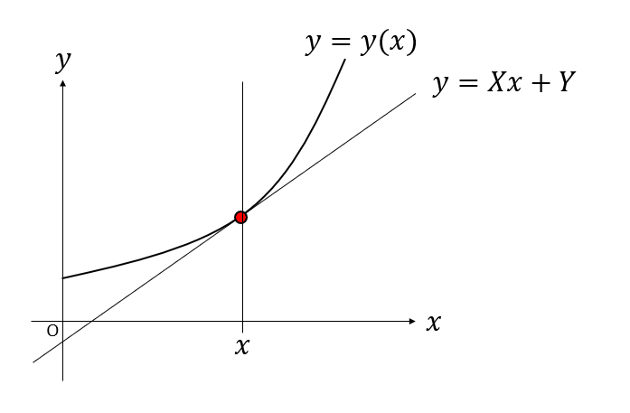

## はじめに

ルジャンドル変換は、自由変数を取り直す変換のことで、双対変換の一種です。双対変換というのは、ざっくり言えば「変換したあと、もう一度変換したらもとにもどる奴」のことです。

例えば正六面体の各面の重心を結ぶと、正八面体になります。この時「正六面体→正八面体」の変換は「面」と「点」の入れ替えに対応しています。同様に、正八面体の各面の重心を結ぶと、正六面体が出てきます。このように、双対変換は「入れ替え」を二度したらもとに戻ります。

また、「AならばB」という命題に対して、「Bでないなら、Aではない」のような命題は対偶と呼ばれますが、両者の真偽は一致します。これも双対です。フーリエ変換やラプラス変換のように、逆変換してもとに戻るやつはだいたい双対変換といって良いでしょう。

このルジャンドル変換の説明として、接線を用いる表式と、面積を用いる表式があります。どちらも同じことを表現していますが、わりと両者の繋がりは不明瞭です。本稿では、両方の気持ちを説明してみようと思います。以下、数学的な厳密さはさておくので、supだのinfだのは出てきません。

## 接線表式

$(x,y)$平面における曲線を考えます。$x$を自由変数として、曲線を$y=y(x)$と表現しましょう。
二次元平面における曲線とは、点$(x,y)$の集合です。

さて、曲線上の点$(x,y)$における接線を考えます。この接線を表す式を

$$
y = Xx + Y
$$

と書きましょう。これは傾き$X$、切片$Y$の直線を表しています。

接線の定義からすぐに

$$
\begin{aligned}
X &= \frac{dy}{dx} \\
Y &= y - x \frac{dy}{dx}
\end{aligned}
$$

であることがわかります。これが$(x,y)$から$(X,Y)$へのルジャンドル変換で、$(x,y)$で表現される点の集合を、$(X,Y)$で表現される直線の集合に入れ替えた、つまり「点」と「線」を入れ替えたことに対応します。

次に、$(X,Y)$の集合を曲線$Y=Y(X)$だと思ってルジャンドル変換してみましょう。

$$
\begin{aligned}
\frac{dY}{dX} &= \frac{dY}{dx}\frac{dx}{dX} = -x\\
Y-X \frac{dY}{dX} &= y - x \frac{dy}{dx} + x \frac{dy}{dx} = y
\end{aligned}
$$

ここから、$(X,Y)$から$(x,y)$に戻すルジャンドル逆変換は、

$$
\begin{aligned}
x &= - \frac{dY}{dX}\\
y &= Y-X \frac{dY}{dX}
\end{aligned}
$$

となります。

順変換と逆変換を並べてみましょう。

$$
\left(
\begin{array}{ccc}
X &=& \displaystyle\frac{dy}{dx}\\
Y &=& y-x \displaystyle \frac{dy}{dx}
\end{array}
\right.
\qquad
\left(
\begin{array}{ccc}
x &=& - \displaystyle\frac{dY}{dX}\\
y &=& Y-X \displaystyle \frac{dY}{dX}
\end{array}
\right.
$$

形はほとんど同じですが、逆変換の$x$の表式に負符号がついています。これを嫌って、接線の式を$y = Xx - Y$と、切片に負符号をつける流儀もあります。すると、負符号がキャンセルして、

$$
\left(
\begin{array}{ccc}
X &=& \displaystyle\frac{dy}{dx}\\
Y &=& x \displaystyle \frac{dy}{dx} -y
\end{array}
\right.
\qquad
\left(
\begin{array}{ccc}
x &=& - \displaystyle\frac{dY}{dX}\\
y &=& X \displaystyle \frac{dY}{dX} -Y
\end{array}
\right.
$$

と、順変換と逆変換が同じ表式になります。

ここで、最終的にもとに戻るならどのような定義を用いても構わないことに注意しましょう。同様な事例に「フーリエ変換で$2\pi$をどちらに押し付けるか問題」があります。工学では順変換には$2\pi$はつけず、逆変換にすべて押し付けますが、数学では対称性を重視してどちらにも$\sqrt{2\pi}$をつけたりします。最終的につじつまが合えばどちらを採用してもかまいません。

## 積分表式

$(x,X)$空間を考えます。この空間における曲線を考えます。$x$を自由変数に取るなら$X=f(x)$、$X$を自由変数にとるなら$x=g(X)$と表現できます。$f$と$g$はお互いに逆関数です。

ここで、$f(x)$を積分したものを$y$を、$g(X)$を積分したものを$Y$と定義します。

$$
\begin{aligned}
y &= \int_0^x f(x) dx \\
Y &= \int_0^X g(X) dX
\end{aligned}
$$

もともと$X=f(x)$、$y=g(X)$でしたから、定義から

$$
X = \frac{dy}{dx} , x = \frac{dY}{dX}
$$

となります。

さて、上の図において長方形が曲線で分割されていると考えると、長方形の面積が$xX$、曲線の下部分の面積が$y$、曲線の左部分の面積が$Y$なので、

$$
y+Y = xX
$$

となります。ここからただちに$(x,y)$と$(X,Y)$の間の変換式が求まります。

$$
\left(
\begin{array}{ccc}
X &=& \displaystyle\frac{dy}{dx}\\
Y &=& y- x \displaystyle \frac{dy}{dx}
\end{array}
\right.
\qquad
\left(
\begin{array}{ccc}
x &=& \displaystyle\frac{dY}{dX}\\
y &=& Y- X \displaystyle \frac{dY}{dX}
\end{array}
\right.
$$

こちらは、自然に順変換と逆変換が同じ形となります。

## ルジャンドル変換の例

大学の物理においてルジャンドル変換は、力学のラグランジアンからハミルトニアンを導くところや、熱力学の自由変数の取り替えなどに現れます。
