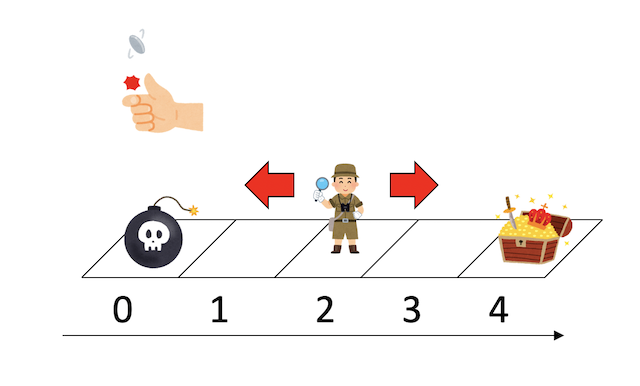
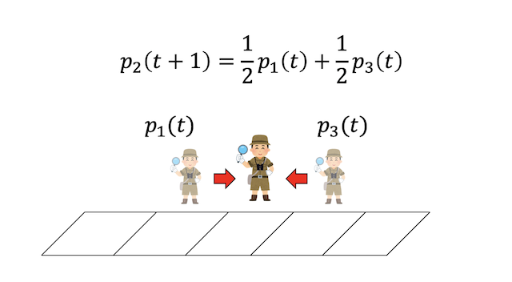

## はじめに

理工系の学生なら、学部で線形代数を習うことでしょう。学部での線形代数は、主に行列やベクトルの性質を調べるものとして学ぶと思います。そこで面倒な計算をして対角化とか固有ベクトルとか固有値とかやって、「なんで行列を対角化しなきゃいけないのか？」「固有ベクトルとか求めて何がうれしいのか？」がいまいちわからないまま卒業し、その後の機械学習ブームで「時代は線形代数！」とか言われて教科書を引っ張り出したは良いけど、でも結局よくわからないままそっと閉じる、なんて人も多いのではと思います。

線形代数は、代数学の一分野です。代数学とはその名の通り「具体的な数」の「代」わりに「記号」を使って式を表現し、その性質を調べる学問です。小学校で「つるかめ算」や「過不足算」をやったと思いますが、中学に入るとそれがすべて方程式や連立方程式で解けてしまうことを習ったと思います。一度方程式に落としてしまえば、もとがリンゴであったか亀の足であったかを全く忘れて、機械的に式を変形していくと答えが出てしまう、そういう抽象性が代数学の強みです(数学は一般にそういう学問ですが……)。逆に言えば、一度式に落としてしまった抽象的な状態では、元が何であったかの情報が落ちています。大学で習う線形代数は、この「抽象化された状態」である行列やベクトルを扱うため、式変形は追うことができても、なんとなく腑に落ちない、という感じになりがちです。また、たまに幾何学的な意味、例えば「行列は回転と拡大縮小を表しており、固有値は拡大率を、固有ベクトルは拡大方向を表す」といった説明を受けても、「だからなに？」という感想で終わりがちです(例えば筆者)。

線形代数は、本当に様々なところに顔を出す学問で、行列や固有値の意味も文脈によって異なります。ここでは行列や固有値が出てくる一つの例として、確率過程との関わりを見てみようと思います。

## すごろくゲーム

簡単なゲームを考えます。0から4までの数字がついたマスが並んでおり、2からスタートです。コインを投げ、表なら一つ上の数字へ、裏なら一つ下の数字へ移動し、4のマスに到達したら「勝ち」で賞金1万円がもらえますが、0のマスに到達してしまうと「負け」で1万円を払わなければいけません。コインには不正が無いものとしましょう。このゲームの獲得賞金の期待値は0であることはなんとなくわかると思います。



さて、このギャンブルの胴元から、「5千円払えば、3のマスからスタートさせてあげます」と言われたとしましょう。この提案に乗るべきでしょうか？それともこれは損な取引でしょうか？

まずは何も考えずにシミュレーションしてみましょう。知りたいのは、確率1/2で左もしくは右に行くすごろくで、iのマスからスタートした場合に「勝ち」に行く確率です。素直に実装するとこうなるでしょうか。

```py
import random

N = 4


def one_trial(start):
    position = start
    while position in range(1, N):
        position += random.choice([-1, 1])
    return position == N


def win_probability(start):
    n_trial = 100000
    win = 0
    for _ in range(n_trial):
        if one_trial(start):
            win += 1
    win_rate = win / n_trial
    print(f"{start} {win_rate}")


for s in range(1, N):
    win_probability(s)
```

実行してみましょう。

```sh
$ python3 mc.py
1 0.25063
2 0.50053
3 0.74683
```

なんとなく、上から$1/4$,$1/2$,$3/4$になってそうですね。$N=5$でやってみましょう。

```sh
$ python3 mc.py
1 0.20026
2 0.40096
3 0.60016
4 0.79874
```

どうやら、$N$マスあるすごろくゲームで、$i$のマスからスタートした場合に「勝つ確率」は$i/N$のようです。これを行列表現で調べてみましょう、というのが本稿の趣旨です。

## マルコフ行列

$t$回コインを投げた時を時刻$t$と呼ぶことにします。時刻$t$に$i$のマスにいる確率を$p_i(t)$としましょう。例えば$t+1$に2のマスにいるためには、$t$の時に1のマスか3のマスにいる必要があり、そこから確率1/2で2のマスにやってきます。式で書くとこうです。

$$
p_2(t+1) = \frac{1}{2}p_1(t)+\frac{1}{2}p_3(t)
$$



さて、時刻$t+1$に1のマスにいるためには、時刻$t$に2のマスにいる必要があります。0のマスは「負け」なので、一度そこにいったらずっと負けのままです。

$$
p_1(t+1) = \frac{1}{2}p_2(t)
$$

同様に、時刻$t+1$に3のマスにいるためには、時刻$t$に2のマスにいる必要があるので、

$$
p_3(t+1) = \frac{1}{2}p_2(t)
$$

また、一度「勝ち」「負け」が確定したら、もう動きません。「勝ち」「負け」には、3や1のマスから確率1/2で行くので、

$$
\begin{aligned}
p_4(t+1) &= p_4(t) + \frac{1}{2} p_3(t) \\
p_0(t+1) &= p_0(t) + \frac{1}{2} p_1(t)
\end{aligned}
$$

これをすべて並べて書くと

$$
\begin{aligned}
p_0(t+1) &= p_0(t) + \frac{1}{2} p_1(t) \\
p_1(t+1) &= \frac{1}{2}p_2(t) \\
p_2(t+1) &= \frac{1}{2}p_1(t)+\frac{1}{2}p_3(t) \\
p_3(t+1) &= \frac{1}{2}p_2(t) \\
p_4(t+1) &= p_4(t) + \frac{1}{2} p_3(t)
\end{aligned}
$$

この式の右辺を見ると、それぞれの確率になにか係数を書けて足し合わせたものになっています。こういう形を**線形結合**と呼びます。何かが線形結合で書けている場合、行列とベクトルの形に書き直すことができます。

$$
\left(
\begin{array}{c}
p_0(t+1)\\
p_1(t+1)\\
p_2(t+1)\\
p_3(t+1)\\
p_4(t+1)
\end{array}
\right)
=
\left(
\begin{array}{ccccc}
1 & 1/2 & 0 & 0 & 0 \\
0 & 0 & 1/2 & 0 & 0 \\
0 & 1/2 & 0 & 1/2 & 0 \\
0 & 0 & 1/2 & 0 & 0 \\
0 & 0 & 0 & 1/2 & 1
\end{array}
\right)
\left(
\begin{array}{c}
p_0(t)\\
p_1(t)\\
p_2(t)\\
p_3(t)\\
p_4(t)
\end{array}
\right)
$$

これを

$$
\vec{p}(t+1) = M \vec{p}(t)
$$

と書きましょう。$\vec{p}$は状態ベクトル、$M$は遷移行列と呼ばれる行列です。

例えば、時刻$t=0$で2のマスにいるとしましょう。確率1で2のマスにいるので、状態ベクトルは${}^t(0,0,1,0,0)$です。これに遷移行列$M$をかけると、次の状態の確率がわかります。

$$
\left(
\begin{array}{c}
0 \\ 1/2 \\ 0 \\ 1/2 \\ 0
\end{array}
\right)
= M
\left(
\begin{array}{c}
0 \\ 0 \\ 1 \\ 0 \\ 0
\end{array}
\right)
$$

これは、ある時刻に2のマスにいた場合、次の時刻で確率1/2で1のマスに、確率1/2で3のマスにいるよ、という意味です。この時、どのような履歴をたどって2のマスにたどり着いたかは、遷移確率に関係しません。このように「次の状態が履歴によらず、現在の状態だけに依存する」ような過程をマルコフ過程と呼びます。先程の遷移行列はマルコフ行列とも呼ばれます。

状態ベクトルと遷移行列の式をもう一度見てみましょう。

$$
\vec{p}(t+1) = M \vec{p}(t)
$$

これは、$M$をかけることで状態ベクトルの時刻が1だけ進むことを表しています。$M$を$n$回かければ、時刻が$n$だけ進みます。したがって、

$$
\vec{p}(n) = M^n \vec{p}(0)
$$

です。我々が知りたいのは、時間が十分に経過した後の振る舞い、つまり

$$
\vec{p}(\infty) = M^\infty \vec{p}(0)
$$

です。つまり、この行列$M$を無限回かけたらどんな行列になるかを調べる必要があります。こんな問題、線形代数の講義で出てきた記憶がありますよね？

## 数値対角化

$M$は5行5列の行列ですが、これを手でいろいろ計算するのは面倒です。とりあえずPythonでいじって、雰囲気を掴みましょう(数式処理ソフトが使える人はそっちを使った方が良いでしょう)。まずは行列を作ります。後で使うので`numpy`や`numpy.linalg`もインポートしておきましょう。

```py
import numpy as np
import numpy.linalg as LA

N = 4

M = np.zeros((N + 1, N + 1))
for i in range(N + 1):
    if i in (0, N):
        M[i][i] = 1.0
    else:
        M[i + 1][i] = 0.5
        M[i - 1][i] = 0.5
```

まずは、Mを十分な回数かけた場合、たとえば100回かけた行列を表示してみましょう。

```py
np.set_printoptions(precision=3)
Minf = M
for _ in range(100):
    Minf = M@Minf
print(Minf)
```

```sh
$ python3 eigen.py
[[1.000e+00 7.500e-01 5.000e-01 2.500e-01 0.000e+00]
 [0.000e+00 0.000e+00 4.441e-16 0.000e+00 0.000e+00]
 [0.000e+00 4.441e-16 0.000e+00 4.441e-16 0.000e+00]
 [0.000e+00 0.000e+00 4.441e-16 0.000e+00 0.000e+00]
 [0.000e+00 2.500e-01 5.000e-01 7.500e-01 1.000e+00]]
```

どうやら、

$$
M^\infty=
\left(
\begin{array}{ccccc}
1 & 3/4 & 1/2 & 1/4 & 0 \\
0 & 0 & 0 & 0 &  0  \\
0 & 0 & 0 & 0 &  0  \\
0 & 0 & 0 & 0 &  0  \\
0 & 1/4 & 1/2 & 3/4 & 1
\end{array}
\right)
$$

になりそうな雰囲気ですね。例えば、最初に1のマスにいた場合、

$$
\left(
\begin{array}{c}
3/4 \\ 0 \\ 0 \\ 0 \\ 1/4
\end{array}
\right)
=
M^\infty
\left(
\begin{array}{c}
0 \\ 1 \\ 0 \\ 0 \\ 0
\end{array}
\right)
$$

となるので、確率$3/4$で0のマス(負け)、確率$1/4$で4のマス(勝ち)に行くことがわかります。この$M^\infty$をもう少し真面目に計算してみましょう。その前に固有値と固有ベクトルについての復習です。あるベクトル$\vec{e}$に行列$M$をかけた時、

$$
M \vec{e} = \lambda \vec{e}
$$

と、元のベクトルの定数倍になる時、このベクトル$\vec{e}$を$M$の固有ベクトル、係数$\lambda$を固有値と呼ぶのでした。5行5列の行列には、固有値と固有ベクトルが5つあります。それぞれ$\lambda_i, \vec{e}_i (i=0,1,2,3,4)$としましょう。

$$
M \vec{e}_i = \lambda_i \vec{e}_i
$$

です。これを$\vec{e}_i$に横に並べてまとめて書いてみましょう。

$$
M
\left(
\begin{array}{ccccc}
\vec{e}_0 &
\vec{e}_1 &
\vec{e}_2 &
\vec{e}_3 &
\vec{e}_4
\end{array}
\right)
=
\left(
\begin{array}{ccccc}
\vec{e}_0 &
\vec{e}_1 &
\vec{e}_2 &
\vec{e}_3 &
\vec{e}_4
\end{array}
\right)
\left(
\begin{array}{ccccc}
\lambda_0 & 0 & 0 & 0 & 0 \\
0 & \lambda_1 & 0 & 0 &  0  \\
0 & 0 & \lambda_2 & 0 &  0  \\
0 & 0 & 0 & \lambda_3 &  0  \\
0 & 0 & 0 & 0 & \lambda_4
\end{array}
\right)
$$

固有ベクトルを横に並べて作った行列を$P$、固有値を対角に並べて作った対角行列を$D$とすると、

$$
MP = PD
$$

と書けます。両辺の右から$P$の逆行列$P^{-1}$をかけると、

$$
P^{-1}MP = D
$$

つまり、固有ベクトルを並べた行列$P$と、その逆行列$P^{-1}$でもとの行列を挟んでやると対角行列$D$になり、その対角成分には固有値が並びます。行列$D$と、$P^{-1}MP$が一致するか確認してみましょう。行列の固有値、固有ベクトルは`numpy.linalg.eig`で得ることができます。固有値は一次元配列で渡されるので、`numpy.diag`で対角行列にしてやりましょう。

```py
w, P = LA.eig(M)
Pinv = LA.inv(P)
D = np.diag(w)
print("D=")
print(D)
print("P^-1MP=")
print(Pinv@M@P)
```

実行結果はこんな感じです。

```txt
D=
[[ 1.     0.     0.     0.     0.   ]
 [ 0.     1.     0.     0.     0.   ]
 [ 0.     0.     0.707  0.     0.   ]
 [ 0.     0.     0.    -0.707  0.   ]
 [ 0.     0.     0.     0.     0.   ]]
P^-1MP=
[[ 1.000e+00  0.000e+00  6.054e-17  6.910e-17  4.531e-17]
 [ 0.000e+00  1.000e+00  0.000e+00  1.943e-16  5.551e-17]
 [ 0.000e+00  0.000e+00  7.071e-01  2.153e-16  6.673e-17]
 [ 0.000e+00  0.000e+00 -2.539e-17 -7.071e-01  4.310e-17]
 [ 0.000e+00  0.000e+00 -7.173e-17 -1.205e-16  5.324e-34]]
```

誤差がちょっと出ていますが、確かに数値的に一致していそうです。

## 行列のベキ乗

さて、行列を対角化してうれしいのは、行列のベキ乗が簡単に計算できるからでした。実際、

$$
\begin{aligned}
D^n &= (P^{-1}MP)^n \\
&= (P^{-1}MP)(P^{-1}MP)(P^{-1}MP)\cdots (P^{-1}MP)\\
&= P^{-1}M^nP
\end{aligned}
$$

なので、

$$
M^n = P D^n P^{-1}
$$

です。ここで$D$は対角行列ですからベキ乗は簡単に計算することができます。さて、もう一度$D$を見てみると、固有値は$1,1,0.707,-0707, 0$の5つです。1以外の固有値はなんどもかければどんどん小さくなるので、

$$
D^{\infty}
=
\left(
\begin{array}{ccccc}
1 & 0 & 0 & 0 & 0 \\
0 & 1 & 0 & 0 &  0  \\
0 & 0 & 0 & 0 &  0  \\
0 & 0 & 0 & 0 &  0  \\
0 & 0 & 0 & 0 & 0
\end{array}
\right)
$$

となります。これを$P$と$P^{-1}$で挟んでやれば$M^{\infty}$が求まることになります。やってみましょう。

```py
Dinf = np.diag([1, 1, 0, 0, 0])
Minf = P@Dinf@Pinv
print(Minf)
```

実行結果はこうなります。

```txt
[[1.   0.75 0.5  0.25 0.  ]
 [0.   0.   0.   0.   0.  ]
 [0.   0.   0.   0.   0.  ]
 [0.   0.   0.   0.   0.  ]
 [0.   0.25 0.5  0.75 1.  ]]
```

確かに

$$
M^\infty=
\left(
\begin{array}{ccccc}
1 & 3/4 & 1/2 & 1/4 & 0 \\
0 & 0 & 0 & 0 &  0  \\
0 & 0 & 0 & 0 &  0  \\
0 & 0 & 0 & 0 &  0  \\
0 & 1/4 & 1/2 & 3/4 & 1
\end{array}
\right)
$$

になっていますね。

## 固有ベクトルによる展開

先程は時間無限大の極限でどうなるか調べるために遷移行列を無限回かけたものがどうなるかを見ました。しかし、時間無限大の極限を調べるには固有ベクトルによる展開の方が便利です。

5行5列の行列には、5つの固有ベクトル$\vec{e}_i (i=0,1,2,3,4)$があります。これらは線形独立なので、任意の5次元ベクトル$\vec{a}$をこれらの線形結合で表すことができます。

$$
\vec{a} = c_0 \vec{e}_0 +
c_1 \vec{e}_1 +
c_2 \vec{e}_2 +
c_3 \vec{e}_3 +
c_4 \vec{e}_4
$$

これを固有ベクトルによる展開と呼びます。固有ベクトルに行列をかけると固有値が出てくるので、

$$
M^n\vec{a} = c_0 \lambda_0^n \vec{e}_0 +
c_1 \lambda_1^n \vec{e}_1 +
c_2 \lambda_2^n \vec{e}_2 +
c_3 \lambda_3^n \vec{e}_3 +
c_4 \lambda_4^n \vec{e}_4
$$

さて、いま$M$の固有値$\lambda_i$は順番に$1,1,0.707,0.707,0$でした。したがって$M$をかける度に固有値の絶対値が$1$より小さな係数はどんどん小さくなります。したがって、$n$無限大の極限で

$$
M^\infty \vec{a}
= c_0 \vec{e}_0
+ c_1 \vec{e}_1
$$

となります。ここで、$\vec{e}_0$は、${}^t(1,0,0,0,0)$、つまり負け状態のベクトル、$\vec{e}_1$は${}^t(0,0,0,0,1)$勝ち状態のベクトルです。Pythonが固有値の大きい順に固有ベクトルを返してくるので、ベクトルのラベルもそれに合わせていることに注意してください。

この式の意味するところは、初期状態を固有ベクトルで展開した時、その展開係数$c_0$と$c_1$が最終的な負けと勝ちの確率を表している、ということです。せっかくなので、この展開係数も行列形式で求めてみましょう。

$$
c_0 \vec{e}_0 +
c_1 \vec{e}_1 +
c_2 \vec{e}_2 +
c_3 \vec{e}_3 +
c_4 \vec{e}_4
= \vec{a}
$$

を行列表示すると、

$$
\left(
\begin{array}{ccccc}
\vec{e}_0 &
\vec{e}_1 &
\vec{e}_2 &
\vec{e}_3 &
\vec{e}_4
\end{array}
\right)
\left(
\begin{array}{c}
c_0 \\ c_1 \\ c_2 \\ c_3 \\ c_4
\end{array}
\right)
=
\vec{a}
$$

固有ベクトルを横に並べた行列は$P$になるのでした。係数$c_i$をまとめてベクトル$\vec{c}$で書くと、

$$
P \vec{c} = \vec{a}
$$

です。なので、

$$
\vec{c} = P^{-1}\vec{a}
$$

と、初期状態のベクトルに固有ベクトルを並べた行列の逆行列をかければ展開係数がわかることになります。やってみましょう。

例えば初期状態として1のマスにいた場合は

```py
a = (np.array([0, 1, 0, 0, 0]))
print(Pinv@a)
```

実行結果はこうなります。

```txt
[ 0.75   0.25   0.784 -0.511  0.791]
```

それぞれ順番に$c_0, c_1, c_2, c_3, c_4$です。このうち、$c_0$が負けの確率、次の$c_1$が勝ちの確率なので、それぞれ3/4、1/4になっていることがわかります。以上から、0から4までラベルのあるすごろくゲームで、3のマスからスタートした場合、勝つ確率は3/4、負ける確率は1/4となることがわかりました。勝った場合は1万円もらえて、負けた場合は1万円失うのですから、期待値は$1 \times 0.75 - 1 \times 0.25 = 0.5$、つまり5千円です。したがって「5千円払ったら3のマスからスタートする」のは、損も得もしないことがわかりました。

ついでに、2のマス、つまり真ん中のマスから始めた場合も見てみましょう。

```py
a = (np.array([0, 0, 1, 0, 0]))
print(Pinv@a)
```

```txt
[5.000e-01 5.000e-01 1.108e+00 7.221e-01 1.065e-17]
```

勝ち負けの確率が1/2になってますね。

## まとめ

行列や固有値が出てくる例として、確率過程を取り上げてみました。すごろくゲームでの勝率計算という、一見すると行列と関係なさそうな題材に、固有ベクトルや対角化といった線形代数で学んだことがわらわら出てきて、確率の時間発展が行列でかけること、その行列を無限回かけると収束先がわかること、初期状態を固有ベクトルで展開してやると最終的にどこに行くかの確率が行列を何度もかけなくてもわかることを見ました。

線形結合が現れるところには必ずといってよいほど行列が顔を出し、その系の性質は固有値や固有ベクトルが決めます。繰り返しになりますが、行列とはなにか抽象化されたものなので、その意味は文脈によって異なります。したがって、固有値や固有ベクトルが意味するものも場合によって変わってきます。「固有値とはどういうものか」のイメージを掴むには、結局のところ場数を踏んでいくしかないのかなと思います。しかし、こうやってプログラムを書いて、「あ、確かに行列が対角化されてるなぁ」とか確認してみると、紙と鉛筆だけで勉強するよりなんとなく腑に落ちる気がします。ここでは一般のNについての厳密解は求めず、数値解のみを調べましたが、興味のある人は厳密解の導出に挑戦してみると良いでしょう。

## 参考文献

* [線形代数を学ぶ理由](https://qiita.com/kaityo256/items/872a2b2fdf977c0e3fbb)
  * 主に数値計算で離散化により現れる線形代数について
* [線形代数というものの見方](https://speakerdeck.com/kaityo256/view-from-linear-algebra)
  * 線形代数の幾何学的な意味、特に回転について
* [a/(b+c)+b/(c+a)+c/(a+b)=4の自然数解(a,b,c)を求める](https://qiita.com/kaityo256/items/c8b703ee04088ef64983)
  * スクリプトを書いて数学を遊ぶ例
