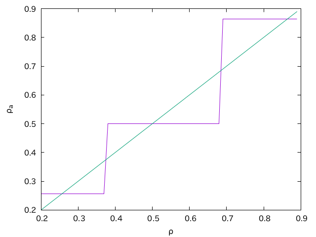

## 概要

分子動力学法で、原子を指定密度で初期配置したいことがよくあります。適当に配置してしまうとエネルギーが爆発してしまったりするので、なるべく原子同士は離して配置したいですね。ここでは、そんな配置手段の一つとして、格子欠陥のある面心立方格子に組む方法を紹介します。

## 欠陥のない面心立方格子

多くの単純原子が面心立方格子(Face Centered Cubic, FCC)状の固体を持ちます。特に、ネオン、アルゴン、クリプトンといった希ガスの固体がFCCとなります。古典分子動力学法で広く使われているLennard-Jones相互作用は希ガスの分子間力を模したものなので、やはり固体はFCCとなります。まずはなるべく指定の密度に近いFCCを組むコードを組んでみましょう。

簡単のため、シミュレーションボックスは一辺$L$の立方体とします。この中に$N$個原子があるなら、数密度は$\rho = N/L^3$で定義されます。FCCの格子定数を$a$としましょう。系は全ての方向に周期境界条件とし、格子不整合がおきないとします。すなわち、$m=L/a$が整数となる条件を考えます。この系には、単位格子が$m^3$個あります。FCCは単位格子あたり4原子ですから、原子数は$4 m^3$個です。以上から、一辺あたりの格子数$m$と密度の関係は

$$
\rho = \frac{4 m^3}{L^3}
$$

となります。格子欠陥がない場合、指定の密度に最も近い$\rho$を実現するように$m$を選びなさい、という問題になります。

これは先ほどの式を$m$について逆に解けば良いので、

$$
m = \sqrt[3]{\frac{L^3 \rho}{4}}
$$

です。$m$は整数でなければいけませんから、指定の密度にたいして近くなるように切り捨てか切り上げをする必要があります。システムサイズと目標密度から、格子数$m$を返す関数を素直に実装してみましょう。

```py
import numpy as np


def get_lattice_number(L, rho):
    m = np.floor((L**3 * rho / 4.0)**(1.0 / 3.0))
    drho1 = np.abs(4.0 * m**3 / L**3 - rho)
    drho2 = np.abs(4.0 * (m + 1)**3 / L**3 - rho)
    if drho1 < drho2:
        return m
    else:
        return m + 1
```

この方法だと、$L$が小さい時に目標密度$\rho$と実現密度$\rho_a$の差が大きくなります。例えば$L=10$の時、$m$が整数という条件なので、例えば$m=4$の時に$\rho_a=0.256$、$m=5$の時に$\rho_a=0.5$、$m=6$の時に$\rho_a=0.864$と、その刻み幅が大きすぎます。目標密度$\rho$と実現密度$\rho_a$をプロットするとこんな感じです。



これをなんとかしましょう、というのが本稿の主題ですが、それはそれとして指定の格子数、格子定数でFCCに組むコードを作っておきましょう。格子定数$a=L/m$の立方体上に原子をおき、そこから$xy$、$yz$、$zx$面に、$a/2$だけずれた「面心」に原子を3つ置けば良いので、こんな感じになるでしょう。

```py
def make_fcc_pure(L, rho):
    m = get_lattice_number(L, rho)
    a = L / m
    ha = a * 0.5
    atoms = []
    for ix in range(a):
        for iy in range(a):
            for iz in range(a):
                x = ix * a
                y = iy * a
                z = iz * a
                atoms.append((x, y, z))
                atoms.append((x + ha, y + ha, z))
                atoms.append((x + ha, y, z + ha))
                atoms.append((x, y + ha, z + ha))
    return atoms
```

$L=10$で$\rho=0.5$なら、$m=5$となります。つまり、格子定数は$a=2$です。隣の原子は、そこからx,y,zのどこか二軸で$a/2=1$だけずれているので、隣接粒子までの距離は$\sqrt{2}$です。見てみましょう。

```py
atoms = make_fcc_pure(10.0, 0.5)
for a in atoms:
    print(f"{a[0]} {a[1]} {a[2]}")
```

実行結果はこんな感じです。

```txt
0.0 0.0 0.0
1.0 1.0 0.0
1.0 0.0 1.0
0.0 1.0 1.0
(snip)
8.0 8.0 8.0
9.0 9.0 8.0
9.0 8.0 9.0
8.0 9.0 9.0
```

なんかできてそうですね。

## 欠陥のある面心立方格子

さて、欠陥のない面心立方格子では、$L$が小さい時に実現できる密度の粒度が粗すぎました。そこで、ちょっと目標密度より高い密度の欠陥のない面心立方格子を用意しておき、そこから粒子を「間引いて」目標の密度を実現してやることにしましょう。

Pythonであれば、`random.sample`を使えば$N$個から$m$個を重複なしに選ぶことができます。素直に実装

