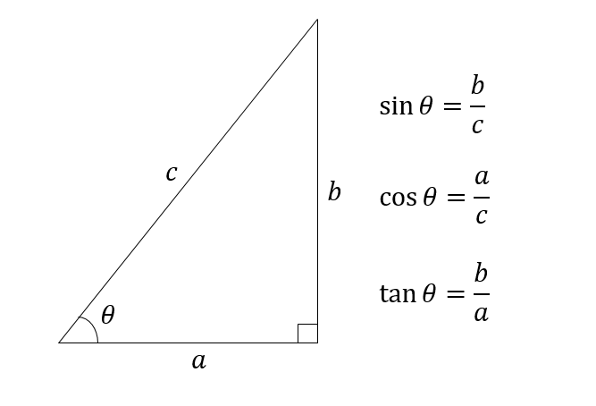

## はじめに

三角関数にあまり良いイメージを持っていない人はわりと多いのではないかと思います。サイン、コサイン、タンジェントの定義はわかっても、そこからごちゃごちゃ出てくる公式の数々に圧倒され、加法定理の公式を「咲いたコスモスコスモス咲いた」のように唱えて覚え、そこから倍角公式だの半角公式だのも出てきて、さらに$\sin(-x)=-\sin(x)$だけど$\cos(-x)=\cos(x)$みたいにサインは符号が入れ替わるけどコサインは入れ替わらないみたいなやつから、$\sin(\theta + \pi/2) = \cos(\theta)$みたいにサインとコサインが入れ替わる奴まで出てきて、イヤになった挙句に社会に出たらそんなの全然でてこなくて、うっかり「三角関数なんて不要だ」などと言おうものなら数学が得意な人から袋叩きに会う、そんな状況で三角関数と仲良くなるのは難しい気がします。

とりあえず「役に立つ」とか「知らなくても不都合は生じない」みたいな議論は他の人にお任せして、三角関数はもう少し面白いものだ、ということをつらつら書いてみたいと思います。

## 三角関数の役目

数学を大きく分けると「幾何学」「代数学」「解析学」の三つの分野にわけることができます。「幾何学」は平面図形や空間図形など「広い意味での図形」を扱う学問です。合同とか相似とかの概念を習ったと思います。大学ではさらに多様体論や位相幾何学といった抽象的な概念に発展していきます。「代数学」は、その名の通り「数」の代わりに文字を導入し、方程式などを解く学問です。連立方程式や二次方程式なんかを習ったと思います。連立方程式から行列などを学び、さらに「線形代数学」へと発展していきます。「解析学」は、極限を扱う学問で、要するに微分や積分などです。

個人的に、三角関数の面白さは、これら三つの分野、「幾何学」「代数学」「解析学」の全てをつなぐ架け橋のような役目を果たすところにあると思います。

いま、三角関数がどのように教えられているかは知りませんが、おそらく直角三角形を持ってきて、その斜辺と残りの二辺の比からサイン、コサイン、タンジェントを定義するところから入るんだと思います。

つまり、三角関数は幾何学の枠組みで導入されます。この後の公式達、例えば加法定理なんかも幾何学的に証明がなされるのではないかと思います。

さて、いまのカリキュラムだと、三角関数の微分は数学IIIで習うんですかね。こうして、まずは幾何学的に定義されたはずの三角関数が、解析学に足を踏み入れることになります。証明や定義はさておき、サインとコサインの微分だけ書いてみましょう。

$$
\begin{aligned}
\frac{d}{d\theta} \sin \theta &= \cos \theta, \\
\frac{d}{d\theta} \cos \theta &= -\sin \theta
\end{aligned}
$$

このように、サインとコサインは微分で互いに入れ替わり、コサインがサインになる時には負符号がつくのでした。

せっかくお互いに入れ替わる性質があるので、それを工夫して表現してみましょう。$\sin \theta$を$\vec{s}$、$\cos \theta$を$\vec{c}$とベクトルで書いてみます。そして、

$$
a \vec{c} + b \vec{s} = 
\begin{pmatrix}
a\\
b
\end{pmatrix}
$$

と表記することにしましょう。微分すると$\vec{c}$は$-\vec{s}$に、$\vec{s}$は$\vec{c}$になるのですから、微分を以下のように行列で表現することができます。

$$
\frac{d}{d\theta} \equiv A = 
\begin{pmatrix}
0 & -1\\
1 & 0 
\end{pmatrix}
$$

さて、この行列$A$をよく見てみましょう。行列の性質は、単位ベクトルにかけて見るとわかります。

$$
\begin{aligned}
A
\begin{pmatrix}
1\\
0 
\end{pmatrix}
&=
\begin{pmatrix}
0\\
1 
\end{pmatrix}\\
A
\begin{pmatrix}
0\\
1 
\end{pmatrix}
&=
\begin{pmatrix}
-1\\
0
\end{pmatrix}
\end{aligned}
$$
