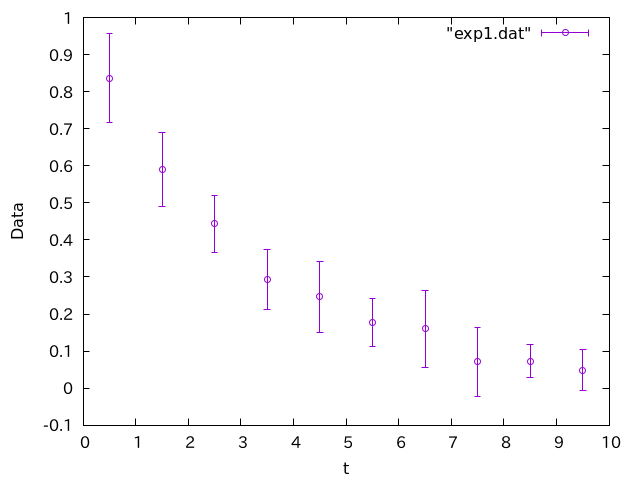
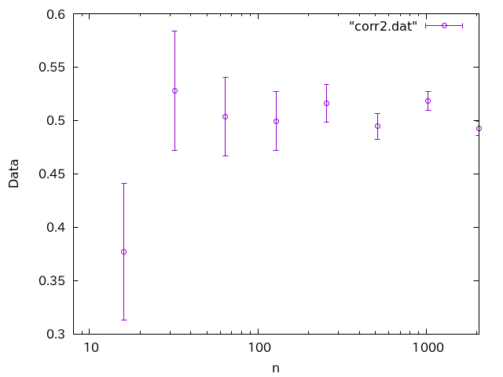
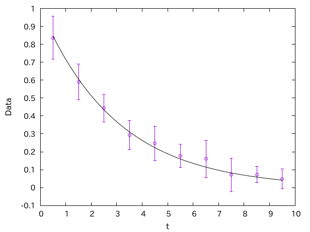

## はじめに

実験や数値計算などでエラーバーがついているグラフをよく使いますが、見ていると「ん？」となるグラフをよく見かけます。いくつか例を挙げて見ましょう。

### ケース1

例えばこんなグラフがあったとします。



何かが時間に対して指数関数的に減衰していることを表しているようです。僕は発表でこういうグラフを見かけたら「ん？」と思います。

一方こちらのグラフは、少なくともエラーバーの付き方はまともです。


### ケース2

もし、観測値のそれぞれに独立なノイズが乗っているのであれば、エラーバーは、観測回数を増やせば減っていくはずです。観測回数$n$に対して、物理量の推定値とエラーバーがどうなるかを表したグラフでこんなものがあったとします。


試行回数$n$を増やすにつれて、平均値は$0.5$に収束し、さらにエラーバーも小さくなっています。一見それっぽく見えますが、僕はこのグラフを見たら「ん？」と思います。

一方、こちらも同様なグラフです。



試行回数$n$を増やすにつれて、平均値は$0.5$に収束し、さらにエラーバーも小さくなっているのは先程と同じですが、こちらはまっとうなグラフに見えます。

### ケース3

シミュレーションでは、時系列を追うことがあります。例えば生データとしてこんなのが得られたとしましょう。


これじゃわけがわからないので、一定区間ごとに区切って平均を取ります。ついでにエラーバーもつけましょう。


慣れている人が見れば、このエラーバーはおかしいと思うでしょう。しかし、エラーバーに詳しく無い人はこのままのグラフを使ってしまいがちです。

以下は「ある処理」をしたデータに対して、同様な解析をしたものです。


こちらはエラーバーがまともです。

これら３つのケースについて、すぐに「おかしい」と思ったでしょうか？以下、それぞれのケースについて何がおかしいかを説明してみます。

## ケース１：エラーバーが大きすぎる

多くの場合、エラーバーは「観測の度に独立なノイズが乗る」ということを仮定してつけます。独立なノイズを何度も観測して平均すると、それはガウス分布に近づきます。そこで、ノイズがガウス分布であると仮定した時に、「観測値の推定値にどれくらい誤差があるか」を推定したものがエラーバーです。平均$\mu$、分散$\sigma^2$のガウス分布は以下のように表現されます。

$$
f(x) = \frac{1}{\sqrt{2\pi \sigma^2}}
\exp\left(-\frac{(x-\mu)^2}{2 \sigma^2} \right)
$$

いくつか流儀がありますが、エラーバーとして$\sigma$の値を取ることが多いです。これを「1シグマ」と呼びます。無限回の観測を行った場合の平均値の期待値を、便宜上「真の値」と呼ぶことにすると、大雑把にいえば「平均値の推測値の両側1シグマの範囲に、真の値が含まれる確率が67%くらいかな？」と思うのが「1シグマのエラーバー」の意味となります。

さて、エラーバーの範囲に「真の値」を含む確率が67%なのですから、逆に言えば3回に一度は「真の値」はエラーバーの範囲外にあるはずです。それを踏まえて、先程のケース1のグラフをもう一度見てみましょう。


なんとなく指数関数的な減衰が見えますね。ありそうな指数関数を重ねてみましょう。



この線は、「この計算の精度を高くしていったら、データはこの線に収束する」と期待される線です。これを見ると、全てのデータ点について、この線にエラーバーがかかってしまっています。3つに1つは外れないとおかしいのですから、このエラーバーは明らかに大きすぎです。

このグラフのデータは以下のコードで作られています。

```py
import numpy as np

N = 10
np.random.seed(1)
for i in range(10):
    x = i + 0.5
    d = np.zeros(N)
    d += np.exp(-x/3)
    d += np.random.randn(N)*0.1
    y = np.average(d)
    e = np.std(d)  # <- 母標準偏差を求めている
    print(f"{x} {y} {e}")
```

指数関数$\exp(-x/3)$に対して、ノイズが乗ったようなデータです。それを各$x$について平均と標準偏差を求めていますが、標準偏差に`numpy.std`を使っています。``numpy.std`は母標準偏差を返しますが、我々がプロットしたいのは「平均値の推定誤差」であり、さらにデータ数$N$の平方根$\sqrt{N}$で割ってやる必要があります。修正しましょう。

```py
import numpy as np

N = 10
np.random.seed(1)
for i in range(10):
    x = i + 0.5
    d = np.zeros(N)
    d += np.exp(-x/3)
    d += np.random.randn(N)*0.1
    y = np.average(d)
    e = np.std(d)/np.sqrt(N)  # √Nで割った
    print(f"{x} {y} {e}")
```

こうして作られたグラフはこうなります。


実線に対して、エラーバーが重ならない点がでてきました。こちらはまっとうなデータに見えます。

一般に、データはエラーバーくらいの振幅で揺らぐはずです。ところが、データの平均値が非常にきれいな振る舞いをしているにも関わらず、エラーバーが大きすぎる場合、何かがおかしいです。よくあるパターンの一つは、このように$\sqrt{N}$での割り忘れですが、他にも観測データに振動が乗っていたりするとエラーバーが大きくなってしまいます。

いずれにせよ、「なんとなくデータが乗ってそうな曲線」に対して、「エラーバーが重なる確率は67%くらい」と思っておくと、変なグラフにすぐに気がつくと思います。

